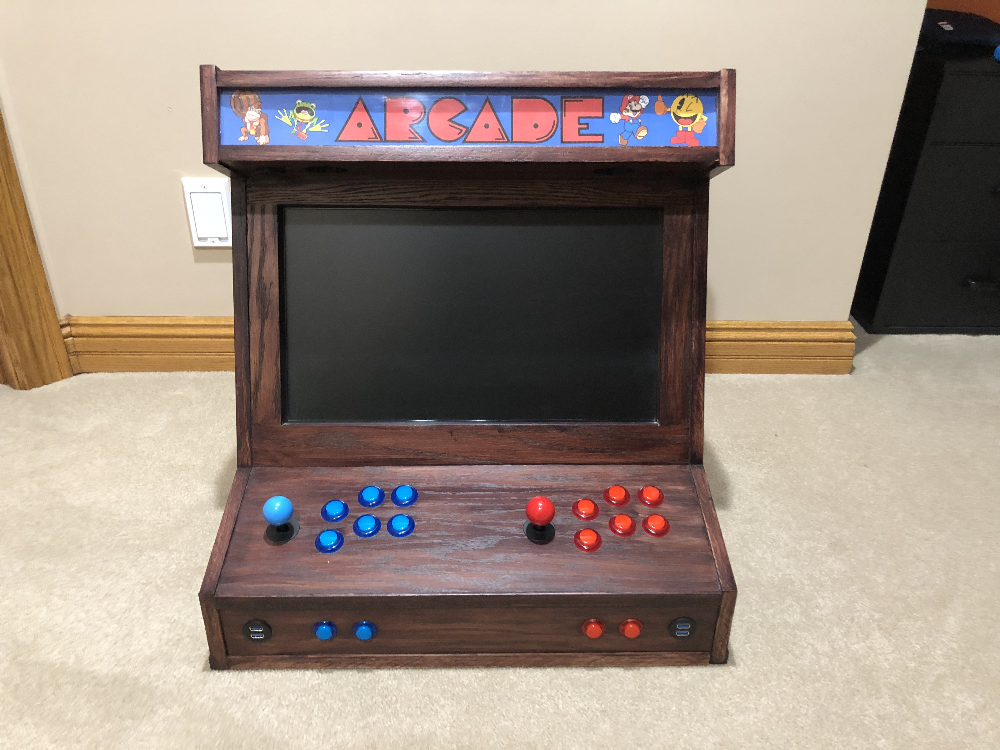

Here are some resources for building an arcade using a Raspberry Pi.

* [RetroPie](https://retropie.org.uk/)
* Roms
    * [http://coolrom.com/](http://coolrom.com/)
    * [https://www.emuparadise.me/](https://www.emuparadise.me/)
* Bartop Arcade
    * [Instructions](https://www.thewoodwhisperer.com/videos/bartop-arcade-raspberry-pi/)
    * [Video](https://youtu.be/nttu_5-zJHo)
* [PiGrrl portable arcade](https://www.adafruit.com/product/3014)
* [Arcade Artwork](http://www.arcadeartwork.org/)
